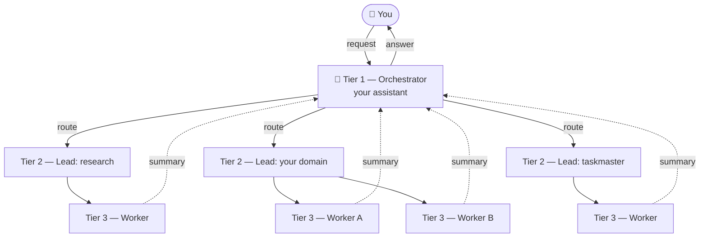
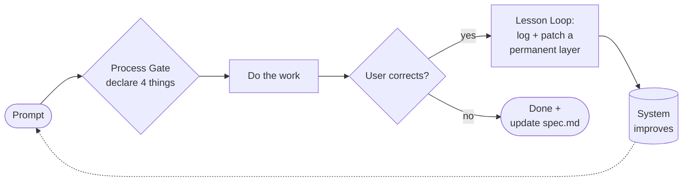

**English** · [ภาษาไทย](README.th.md)

# Agis Method — a disciplined operating framework for Claude Code

**The "way of working" of a real personal AI assistant, packaged as a template you can clone and make your own.**

Not an app, not a plugin — a set of **rules + hooks + structure** that turns Claude Code from a
one-off answer machine into an assistant that is:

- **Disciplined** — declares its intent before acting on any real task (Process Gate), instead of rushing in
- **Self-improving** — every correction must end in a permanent patch (Lesson Loop): the more it errs, the better it gets
- **A second brain** — always consults your existing knowledge/skills first, never starts from scratch
- **Team-structured** — Orchestrator → Team Lead (subagent) → Worker
- **Persistent** — a memory + wiki + daily-note system, all wired into one Obsidian graph

> Everything here is **genericized and free of any personal data** — safe to publish and fork.

> 🤖 **Any AI, not just Claude.** The rules are tool-agnostic (`AGENTS.md`) — use them with Cursor,
> Windsurf, Cline, Gemini CLI, Codex, Copilot, and more. Easiest path: paste the prompt in
> **[PROMPT.md](PROMPT.md)** and let your own AI set it up. Details in **[ADOPTING.md](ADOPTING.md)**.

> ℹ️ **Language note:** the framework prose (CLAUDE.md, skills, templates) is written in **Thai**, the
> author's language. The *structure* is language-agnostic — translate `CLAUDE.md` to your language, or
> keep it bilingual. The mechanisms below work regardless of language.

---

## How it works — the 3-tier team

You talk to one **Orchestrator**. It routes each task to a **Team Lead** (a real Claude Code subagent),
who may delegate to a **Worker**, then summarizes back up to you.



## The discipline loop — why it stays sharp

Two hooks fire on every prompt. The **Process Gate** forces a plan before work; the **Lesson Loop**
turns every correction into a permanent fix at the right layer.



**Patch ladder** (where a lesson gets fixed, most-permanent first): `hook` → `skill` → `CLAUDE.md`/`memory` → `wiki`.

---

## Quick start

```bash
# 1. clone into the folder that will become your "vault"
git clone https://github.com/JirawatHQ/agis-method my-assistant && cd my-assistant

# 2. run setup — it asks for the assistant's name / your role / language, then fills them in
bash setup.sh

# 3. open Claude Code in this folder → hooks activate automatically
claude
```

Then take `global-CLAUDE.template.md` to `~/.claude/CLAUDE.md` (merge if you already have one), and
fill in the remaining `{{...}}` placeholders in `CLAUDE.md`.

> **Already have a project** (with its own `CLAUDE.md` / hooks)? **Don't clone over it** — see
> **[ADOPTING.md](ADOPTING.md)** for the merge recipe.
> **Requirements:** bash (Git Bash or WSL on Windows) + python 3.x (`python3` *or* `python` — auto-detected).

## What's in the box

| Part | File | What it is |
|------|------|-----------|
| Core rules | `CLAUDE.md` | The full framework (Process Gate, Lesson Loop, Second Brain, protocols) |
| Identity | `global-CLAUDE.template.md` | The assistant's persona → copy to `~/.claude/CLAUDE.md` |
| Enforcement | `scripts/*.sh` + `.claude/settings.json` | Hooks — process gate, lesson loop, graph hygiene |
| Teams | `.claude/agents/` + `teams/` | Orchestrator → Lead → Worker (with `_TEMPLATE` files) |
| Knowledge | `context/wiki/` | Distilled knowledge base (starts empty) |
| Memory | `context/memory/` + `MEMORY.md` | Memory system + Obsidian graph mirror |
| Tools | `.claude/skills/` | **11 general-purpose skills**, ready to use |
| Graph | `context/admin/obsidian_graph.py` | Keeps the Obsidian graph free of orphans/broken links |

Portability: hooks reference `$CLAUDE_PROJECT_DIR`, so cloning "just works" — **no path editing needed**.

## Philosophy

> **Hook > text.** A reminder in `CLAUDE.md` is only a nudge — an LLM can always skip it.
> Real enforcement is a hook that runs every time. Every important rule here is backed by a hook.

> **The more it errs, the better it gets.** The system isn't perfect on day one — it improves because
> every mistake is logged and patched into a permanent layer (the Lesson Loop). Use it, and it learns you.

## Make it yours

- **Teams:** delete the examples, create teams that fit your life (copy `_TEMPLATE-lead.md`)
- **Skills:** keep what you use, drop the rest, add new ones via the Ingest Workflow (see `CLAUDE.md`)
- **Hooks:** toggle them in `.claude/settings.json`

## Credits & License

Some skills are distilled/adapted from public community work — see `.claude/skills/README.md` for
attribution; please keep upstream credit when redistributing. Licensed under [MIT](LICENSE).

---
## Connections
<!-- this repo is itself an Obsidian vault; the wiki-style links below are intentional -->
- [[CLAUDE]]
- [[README.th]]
- [[global-CLAUDE.template]]
