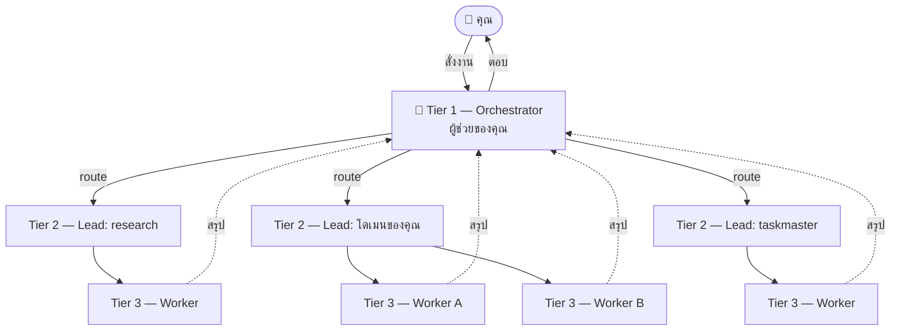
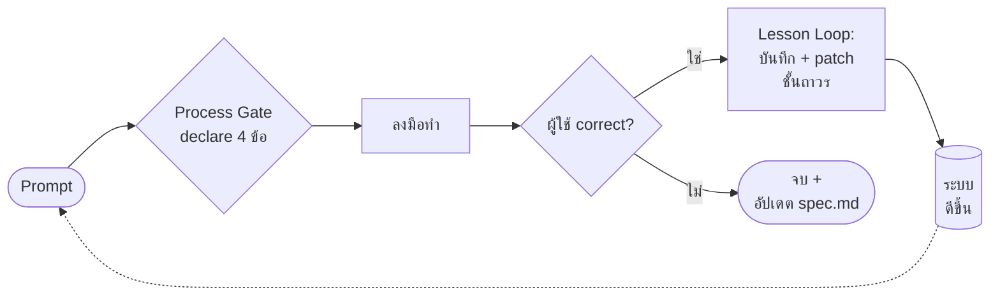

[English](README.md) · **ภาษาไทย**

# Agis Method — starter kit สำหรับ Claude Code

**"วิธีการทำงาน" ของผู้ช่วย AI ส่วนตัวที่ใช้จริง — แพ็กเป็น template ให้ก็อปไปตั้งของตัวเองได้**

ไม่ใช่แอป ไม่ใช่ปลั๊กอิน — เป็น **ชุดกฎ + hooks + โครงสร้าง** ที่ทำให้ Claude Code:
- **มีวินัย** — ประกาศเจตนาก่อนลงมือทุกงาน (Process Gate) ไม่พุ่งทำมั่ว
- **เรียนรู้จากที่ผิด** — ทุก correction ต้องจบด้วย patch ถาวร (Lesson Loop)
- **ไม่เริ่มจากศูนย์** — ดึงจาก knowledge base/skill ที่มีก่อนเสมอ (Second Brain)
- **จัดระบบงานเป็นทีม** — Orchestrator → Team Lead (subagent) → Worker
- **จำได้ข้ามครั้ง** — ระบบ memory + wiki + daily note ที่เชื่อมกันเป็นกราฟเดียว

> ทั้งหมดนี้ **ไม่มีข้อมูลส่วนตัวของใครติดมา** — genericize แล้ว เอาขึ้น public ได้

> 🤖 **ใช้กับ AI ตัวไหนก็ได้ ไม่จำกัดแค่ Claude** — กฎเป็นกลาง (`AGENTS.md`) ใช้กับ Cursor, Windsurf,
> Cline, Gemini CLI, Codex, Copilot ฯลฯ ได้. ทางง่ายสุด: paste prompt ใน **[PROMPT.md](PROMPT.md)**
> ให้ AI ของคุณเซ็ตให้เอง. รายละเอียด **[ADOPTING.md](ADOPTING.md)**

---

## ทำงานยังไง — ทีม 3 ชั้น

คุยกับ **Orchestrator** ตัวเดียว → มันจ่ายงานให้ **Team Lead** (subagent จริงของ Claude Code)
→ Lead อาจส่งต่อ **Worker** → แล้วสรุปกลับขึ้นมาหาคุณ



## วงจรวินัย — ทำไมถึงคมขึ้นเรื่อยๆ

hook 2 ตัวยิงทุก prompt: **Process Gate** บังคับวางแผนก่อนทำ, **Lesson Loop** เปลี่ยนทุก correction
เป็นการแก้ถาวรที่ชั้นที่ถูกต้อง



**บันไดการ patch** (แก้ที่ชั้นไหน เรียงถาวรสุดก่อน): `hook` → `skill` → `CLAUDE.md`/`memory` → `wiki`

---

## เริ่มใช้ (3 ขั้น)

```bash
# 1. clone เข้าโฟลเดอร์ที่จะเป็น "vault" ของคุณ
git clone https://github.com/JirawatHQ/agis-method my-assistant && cd my-assistant

# 2. รัน setup — จะถามชื่อผู้ช่วย/บทบาท/ภาษา แล้วเติมให้อัตโนมัติ
bash setup.sh

# 3. เปิด Claude Code ในโฟลเดอร์นี้ → hooks ทำงานเองทันที
claude
```

จากนั้นเอา `global-CLAUDE.template.md` ไปวางเป็น `~/.claude/CLAUDE.md` (ถ้ามีอยู่แล้วให้ merge)
แล้วแก้ `{{...}}` ที่เหลือใน `CLAUDE.md`

> **มีโปรเจกต์อยู่แล้ว** (มี `CLAUDE.md` / hooks ของตัวเอง)? **อย่า clone ทับ** — ดูวิธี merge ที่
> **[ADOPTING.md](ADOPTING.md)**.
> **ต้องมี:** bash (Windows ใช้ Git Bash หรือ WSL) + python 3.x (`python3` หรือ `python` ก็ได้ hook เลือกเอง)

## มีอะไรในกล่อง

| ส่วน | ไฟล์ | คืออะไร |
|------|------|---------|
| กฎหลัก | `CLAUDE.md` | เฟรมเวิร์กทั้งหมด (Process Gate, Lesson Loop, Second Brain, ...) |
| ตัวตน | `global-CLAUDE.template.md` | identity ของผู้ช่วย → ก็อปไป `~/.claude/CLAUDE.md` |
| กลไกบังคับ | `scripts/*.sh` + `.claude/settings.json` | hooks — process gate, lesson loop, graph hygiene |
| ทีม | `.claude/agents/` + `teams/` | โครง Orchestrator → Lead → Worker (มี `_TEMPLATE`) |
| ความรู้ | `context/wiki/` | knowledge base ที่ distill แล้ว (เริ่มเปล่า) |
| ความจำ | `context/memory/` + `MEMORY.md` | ระบบ memory + graph mirror |
| เครื่องมือ | `.claude/skills/` | **11 skills ทั่วไป** พร้อมใช้ |
| graph | `context/admin/obsidian_graph.py` | รักษากราฟ Obsidian ไม่ให้ orphan/broken |

พกพา: hooks ใช้ `$CLAUDE_PROJECT_DIR` → clone แล้วรันได้ **ไม่ต้องแก้ path**

## ปรัชญาเบื้องหลัง
> **hook > text.** ข้อความเตือนใน CLAUDE.md เป็นแค่ nudge — LLM ข้ามได้ตลอด.
> การบังคับจริงคือ hook ที่รันทุกครั้ง. ทุกกฎสำคัญในนี้จึงมี hook หนุนหลัง

> **ยิ่งผิด ยิ่งเก่ง.** ระบบไม่ได้สมบูรณ์ตั้งแต่แรก — มันดีขึ้นเพราะทุกครั้งที่พลาด
> ถูกบันทึกและ patch ลงชั้นถาวร (Lesson Loop) ใช้ไปเรื่อยๆ มันจะรู้จักคุณมากขึ้น

## ปรับให้เป็นของคุณ
- **ทีม:** ลบทีมตัวอย่าง สร้างทีมตามชีวิตจริง (ก็อป `_TEMPLATE-lead.md`)
- **skills:** เก็บที่ใช้ ลบที่ไม่ใช้ เพิ่มใหม่ผ่าน Ingest Workflow (ดู `CLAUDE.md`)
- **hooks:** เปิด/ปิดใน `.claude/settings.json`

## เครดิต / License
Skills บางตัวกลั่น/รวบรวมจากงานสาธารณะของชุมชน — ดูที่มาใน `.claude/skills/README.md`
โปรดคงเครดิตต้นทางเมื่อแจกจ่ายต่อ · ใช้สัญญาอนุญาต [MIT](LICENSE)

---
## Connections
- [[CLAUDE]]
- [[README]]
- [[global-CLAUDE.template]]
